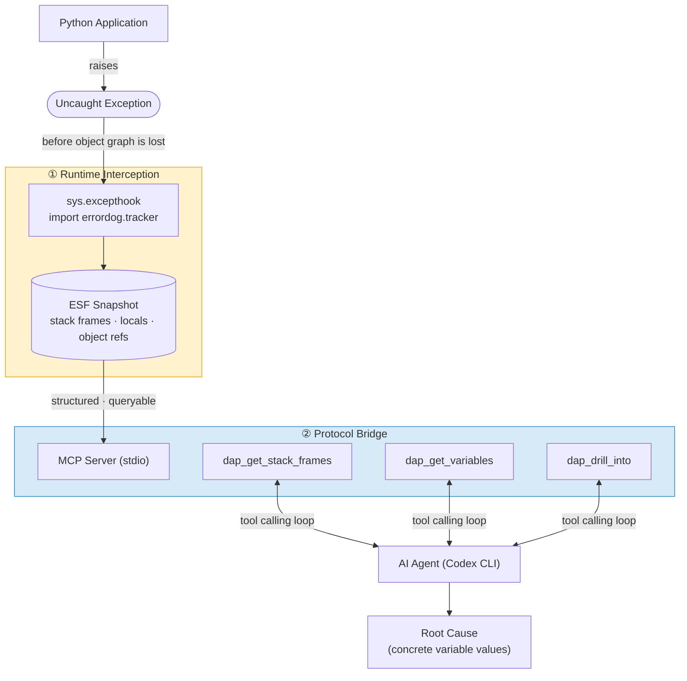

# Errordog



Python 런타임 에러를 자동으로 캡처하고, AI 에이전트가 MCP/HTTP 도구로 분석하는 하이브리드 디버깅 서버.

```
에러 발생 → 스냅샷 자동 저장 → AI가 직접 조회 → 원인 특정
```

터미널 로그를 복붙하지 않아도, AI 에이전트가 스택 프레임과 로컬 변수를 구조적으로 탐색합니다.

---

## Features

- **Zero-config capture** — `import errordog.tracker` 한 줄로 uncaught exception 자동 저장
- **MCP server** — Claude Code, Codex CLI 등 MCP 클라이언트에서 바로 연동
- **HTTP REST API** — ChatGPT Custom GPT Actions, 외부 도구 연동
- **DAP post-mortem** — VS Code Variables 패널에서 스냅샷 시각화 (breakpoint 없이)
- **Nested object drill-down** — `dap_get_variables` → `dap_drill_into`로 중첩 dict/list 계층 탐색
- **Expression evaluation** — 크래시 시점 컨텍스트에서 Python 표현식 실행
- **Reproduction test gen** — 에러 재현 pytest 코드 자동 생성

---

## Quick Start

### Install

```bash
pip install errordog
# or
uv add errordog
```

### Capture errors automatically

```python
import errordog.tracker  # 이 한 줄이 전부

def calculate_price(items):
    return sum(item["price"] * item["qty"] for item in items)

orders = [
    {"price": 1500, "qty": 2},
    {"price": "free", "qty": 1},  # bug: string instead of int
]
calculate_price(orders)
```

```
$ python app.py
[errordog] Snapshot captured: err_20260526T120000_a3f2b1
Traceback (most recent call last):
  ...
TypeError: unsupported operand type(s) for +: 'int' and 'str'
```

스냅샷은 `~/.errordog/snapshots/` 에 저장됩니다.

---

## MCP Integration

### Claude Code

```bash
# MCP 서버 시작 (stdio transport)
errordog serve

# Claude Code 프로젝트에 등록
claude mcp add errordog -- errordog serve
```

또는 `.claude/mcp.json`:

```json
{
  "mcpServers": {
    "errordog": {
      "command": "errordog",
      "args": ["serve"]
    }
  }
}
```

### OpenAI Codex CLI

`~/.codex/config.yaml` 또는 프로젝트의 `.codex/config.yaml`:

```yaml
mcpServers:
  errordog:
    command: errordog
    args: [serve]
```

### Recommended Prompt

MCP 연동 후 아래 프롬프트를 사용하세요:

```
최근 Python 에러를 분석해줘.

1. list_errors()로 최신 에러 확인
2. dap_get_stack_frames(error_id)로 콜스택 탐색
3. dap_get_variables(error_id, frame_index=0)로 크래시 시점 변수 확인
4. variablesReference > 0인 변수는 dap_drill_into()로 전개
5. 구체적인 변수값을 근거로 원인 설명
```

---

## HTTP API (ChatGPT / REST)

```bash
# HTTP 서버 시작
errordog serve --http --port=8080
```

### Endpoints

| Method | Path | Description |
|--------|------|-------------|
| `GET` | `/health` | 서버 상태 확인 |
| `GET` | `/openapi.json` | OpenAPI 3.0 스펙 (자동 생성) |
| `POST` | `/tools/list_errors` | 에러 목록 조회 |
| `POST` | `/tools/get_error_details` | 특정 에러 전체 데이터 |
| `POST` | `/tools/dap_get_stack_frames` | 콜스택 프레임 |
| `POST` | `/tools/dap_get_variables` | 프레임 로컬 변수 |
| `POST` | `/tools/dap_drill_into` | 중첩 객체 전개 |
| `POST` | `/tools/evaluate_expression` | 표현식 평가 |
| `POST` | `/tools/generate_reproduction_test` | 재현 테스트 생성 |

```bash
# 예시
curl http://localhost:8080/openapi.json           # ChatGPT Actions 등록용 스펙
curl -X POST http://localhost:8080/tools/list_errors -H "Content-Type: application/json" -d '{}'
```

### ChatGPT Custom GPT Actions 연동

1. `errordog serve --http --port=8080` 실행
2. ngrok 등으로 공개 URL 생성: `ngrok http 8080`
3. ChatGPT Custom GPT → Actions → `https://<your-url>/openapi.json` 등록

---

## MCP Tools Reference

| Tool | 파라미터 | 설명 |
|------|---------|------|
| `list_errors()` | — | 스냅샷 목록 (최신순) |
| `get_error_details(error_id)` | `error_id` | 전체 ESF JSON |
| `dap_get_stack_frames(error_id)` | `error_id` | 콜스택 (frame_index 포함) |
| `dap_get_variables(error_id, frame_index=0)` | `error_id`, `frame_index` | 로컬 변수 + variablesReference |
| `dap_drill_into(error_id, variables_reference)` | `error_id`, `variables_reference` | 중첩 객체 전개 |
| `evaluate_expression(expression, error_id, frame_index=0)` | `expression`, `error_id`, `frame_index` | 표현식 평가 |
| `generate_reproduction_test(error_id)` | `error_id` | pytest 재현 코드 생성 |

### Drill-down Example

중첩 객체 `payment = {"amount": 500000, "discount": {"rate": 1.5}}` 분석:

```
dap_get_variables(error_id, 0)
→ payment: {"amount": ..., "discount": ...}  variablesReference=1001

dap_drill_into(error_id, 1001)
→ amount: 500000
→ discount: {...}  variablesReference=1002

dap_drill_into(error_id, 1002)
→ rate: 1.5    ← 원인 특정
→ code: "INVALID_CODE"
```

---

## VS Code DAP Debugging

스냅샷을 VS Code Variables 패널에서 시각화하는 post-mortem 디버깅.

```bash
# DAP 서버 시작
errordog dap
```

`.vscode/launch.json`:

```json
{
  "configurations": [
    {
      "name": "Errordog Post-Mortem",
      "type": "debugpy",
      "request": "attach",
      "connect": { "host": "localhost", "port": 5679 },
      "preLaunchTask": "Errordog: Select Snapshot"
    }
  ]
}
```

`.vscode/tasks.json`:

```json
{
  "tasks": [{
    "label": "Errordog: Select Snapshot",
    "type": "shell",
    "command": "errordog select"
  }]
}
```

---

## CLI Commands

```bash
errordog serve                        # MCP 서버 (stdio)
errordog serve --http --port=8080     # HTTP REST API 서버
errordog dap                          # DAP 서버 (post-mortem + live proxy)
errordog select                       # 스냅샷 선택 (DAP에서 사용할 error_id 저장)
errordog clean                        # 스냅샷 전체 삭제
errordog run <script.py> [args...]    # 스크립트 실행 + 에러 캡처
```

---

## A/B Testing

Errordog 없이 스택트레이스만으로 진단할 때와 비교하는 자동화 테스트:

```bash
# 1. HTTP 서버 시작 (다른 터미널)
errordog serve --http --port=8080

# 2. A/B 테스트 실행
cd sample
OPENAI_API_KEY=sk-... python ab_test.py

# 특정 시나리오만
python ab_test.py --scenarios orders,payment

# 모델 지정
python ab_test.py --model gpt-4o
```

결과 예시:

```
Errordog A/B Test  |  codex=codex  |  scenarios=5
Condition A: stacktrace only (MCP isolated)
Condition B: Errordog MCP tools (dap_get_stack_frames → dap_get_variables → dap_drill_into)

── Scenario: orders ──
  Running orders.py … snapshot=err_20260526T045252_6bfe04…
  Condition A (stacktrace only) … done (17.87s)
  Condition B (Errordog MCP) … done (0 tool calls, 36.05s)

───────────────────────────────────────────────────────────────────
Scenario : orders — TypeError — string price × int quantity
Error ID : err_20260526T045252_6bfe04
───────────────────────────────────────────────────────────────────
Metric                          A: Stacktrace        B: Errordog
───────────────────────────────────────────────────────────────────
Net input tokens                       16,307             38,552
Output tokens                             624                407
Total tokens                           16,931             38,959
MCP tool calls                              0                  0
Response time (s)                        17.9               36.0
Specificity score                        25%              100%
Root cause identified               ✗ Partial              ✓ Yes
───────────────────────────────────────────────────────────────────
  A: The root cause is that at least one `item` in `orders` has `item["price"] * item["qty"]` evaluating to a `str`, not a nu…
  B: The crash occurs in `calculate_total` at `orders.py:8` because `items[2]` has `price='free'` as a string while `qty=1` i…
── Scenario: payment ──
  Running payment.py … snapshot=err_20260526T045346_7cbc5a…
  Condition A (stacktrace only) … done (11.88s)
  Condition B (Errordog MCP) … done (0 tool calls, 34.08s)

───────────────────────────────────────────────────────────────────
Scenario : payment — ValueError — discount rate > 1 causes negative amount
Error ID : err_20260526T045346_7cbc5a
───────────────────────────────────────────────────────────────────
Metric                          A: Stacktrace        B: Errordog
───────────────────────────────────────────────────────────────────
Net input tokens                          457             21,126
Output tokens                             191                327
Total tokens                              648             21,453
MCP tool calls                              0                  0
Response time (s)                        11.9               34.1
Specificity score                       100%              100%
Root cause identified                   ✓ Yes              ✓ Yes
───────────────────────────────────────────────────────────────────
  A: The root cause is that `apply_discount()` received a payment with `original=500000`, `rate=1.5`, and `code='INVALID_CODE…
  B: The crash is caused by an invalid discount rate: `payment["discount"]["rate"]` is `1.5` for code `'INVALID_CODE'`, so `a…
── Scenario: inventory ──
  Running inventory.py … snapshot=err_20260526T045433_6e97cf…
  Condition A (stacktrace only) … done (21.92s)
  Condition B (Errordog MCP) … done (0 tool calls, 49.1s)

───────────────────────────────────────────────────────────────────
Scenario : inventory — ZeroDivisionError — avg_stock is 0 for discontinued category
Error ID : err_20260526T045433_6e97cf
───────────────────────────────────────────────────────────────────
Metric                          A: Stacktrace        B: Errordog
───────────────────────────────────────────────────────────────────
Net input tokens                       16,338             41,672
Output tokens                             352                567
Total tokens                           16,690             42,239
MCP tool calls                              0                  0
Response time (s)                        21.9               49.1
Specificity score                        50%              100%
Root cause identified                   ✓ Yes              ✓ Yes
───────────────────────────────────────────────────────────────────
  A: The root cause is that `calculate_turnover_rate()` attempted `sold / avg_stock` when `avg_stock = 0.0`. The stacktrace p…
  B: Root cause: `calculate_turnover_rate` is processing category `'Discontinued'` where `sold=0`, `opening_stock=0`, `closin…
── Scenario: user_auth ──
  Running user_auth.py … snapshot=err_20260526T045544_2a72b4…
  Condition A (stacktrace only) … done (13.25s)
  Condition B (Errordog MCP) … done (0 tool calls, 45.92s)

───────────────────────────────────────────────────────────────────
Scenario : user_auth — KeyError — 'role' key missing from permissions dict
Error ID : err_20260526T045544_2a72b4
───────────────────────────────────────────────────────────────────
Metric                          A: Stacktrace        B: Errordog
───────────────────────────────────────────────────────────────────
Net input tokens                       16,323             40,913
Output tokens                             279                551
Total tokens                           16,602             41,464
MCP tool calls                              0                  0
Response time (s)                        13.2               45.9
Specificity score                        60%               80%
Root cause identified                   ✓ Yes              ✓ Yes
───────────────────────────────────────────────────────────────────
  A: The root cause is `build_session_token(user)` indexing `permissions["role"]` when `permissions` does not contain the key…
  B: The root cause is a `KeyError` at `user_auth.py:10`: `build_session_token()` reads `permissions["role"]`, but the crash-…
── Scenario: report_gen ──
  Running report_gen.py … snapshot=err_20260526T045644_924358…
  Condition A (stacktrace only) … done (12.34s)
  Condition B (Errordog MCP) … done (0 tool calls, 28.48s)

───────────────────────────────────────────────────────────────────
Scenario : report_gen — TypeError — fetch_sales_data returns None for unknown region
Error ID : err_20260526T045644_924358
───────────────────────────────────────────────────────────────────
Metric                          A: Stacktrace        B: Errordog
───────────────────────────────────────────────────────────────────
Net input tokens                       16,297             19,803
Output tokens                             229                265
Total tokens                           16,526             20,068
MCP tool calls                              0                  0
Response time (s)                        12.3               28.5
Specificity score                        50%               50%
Root cause identified                   ✓ Yes              ✓ Yes
───────────────────────────────────────────────────────────────────
  A: The immediate root cause is that `data` is `None` at `report_gen.py:18`, but the code tries to access it like a dictiona…
  B: Root cause: `generate_regional_report` reached `region == 'Daegu'` for `month == '2026-04'`, but the lookup result `data…

═══════════════════════════════════════════════════════════════════
SUMMARY
═══════════════════════════════════════════════════════════════════
Metric                          A: Stacktrace        B: Errordog
───────────────────────────────────────────────────────────────────
Avg net input tokens                   13,144             32,413
Avg output tokens                         335                423
Avg total tokens                       13,479             32,837
Avg MCP tool calls                          0                0.0
Avg response time (s)                    15.5               38.7
Avg specificity                          57%               86%
Root cause found             4/5 (80%)             5/5 (100%)
═══════════════════════════════════════════════════════════════════
```

자세한 내용은 [`sample/README.md`](sample/README.md) 참조.

---

## How It Works

### Snapshot Format (ESF)

```json
{
  "error_id": "err_20260526T120000_a3f2b1",
  "timestamp": "2026-05-26T12:00:00Z",
  "exception_type": "TypeError",
  "exception_message": "unsupported operand type(s) for +: 'int' and 'str'",
  "tracelog": "...",
  "cwd": "/Users/dev/project",
  "frames": [
    {
      "file_path": "orders.py",
      "line_number": 8,
      "function_name": "calculate_total",
      "locals": {
        "item": "{'price': 'free', 'qty': 1}",
        "items": "[...]"
      }
    }
  ]
}
```

### Architecture

```
Python App
    │  import errordog.tracker
    │  (sys.excepthook override)
    ▼
~/.errordog/snapshots/{error_id}.json   ← ESF 저장
    │
    ├── MCP (stdio) ────────────────── Claude Code, Codex CLI
    ├── HTTP (REST) ────────────────── ChatGPT, curl, 외부 도구
    └── DAP (TCP:5679) ─────────────── VS Code, Neovim
```

---

## Development

```bash
git clone https://github.com/djoo-lgcns/errordog
cd errordog
uv sync

# 테스트
uv run pytest

# 빌드
uv build
```

---

## License

MIT
