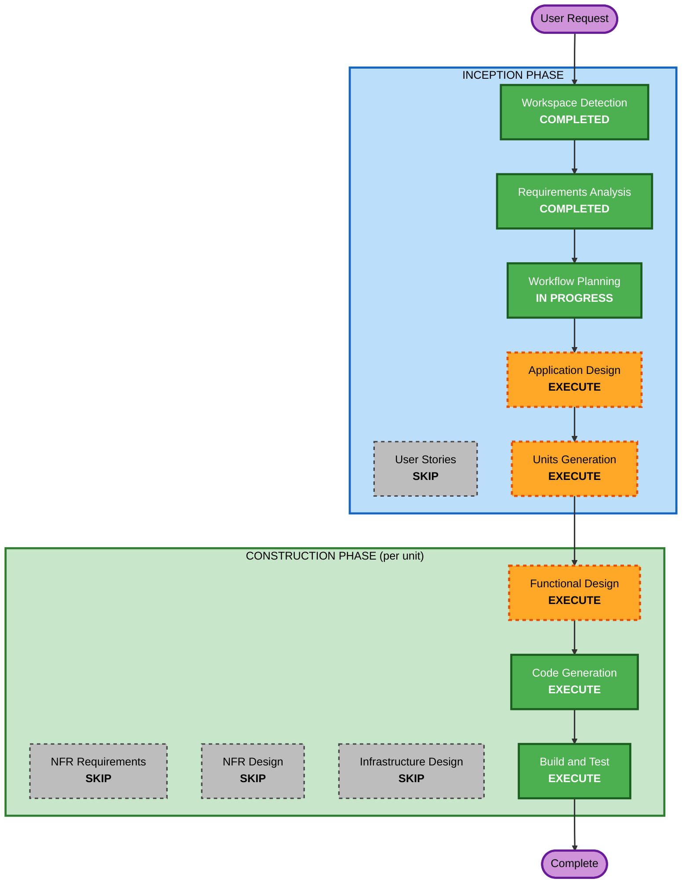

# Execution Plan

## Detailed Analysis Summary

### Change Impact Assessment
- **User-facing changes**: Yes - New developer tool with MCP tools, DAP integration, IDE automation
- **Structural changes**: Yes - Entirely new multi-component system (MCP server, tracker, DAP proxy, AI tools)
- **Data model changes**: Yes - New ESF (Errordog Snapshot Format) JSON schema
- **API changes**: Yes - New MCP tools API, DAP protocol proxy, IDE RPC
- **NFR impact**: No - Prototype/experimental, security extensions disabled

### Risk Assessment
- **Risk Level**: Medium (multi-protocol system, but incremental delivery reduces risk)
- **Rollback Complexity**: Easy (greenfield, no existing system to protect)
- **Testing Complexity**: Moderate (MCP + DAP protocol testing, IDE integration)

---

## Workflow Visualization



### Text Alternative
```
INCEPTION PHASE:
  1. Workspace Detection     (COMPLETED)
  2. Requirements Analysis   (COMPLETED)
  3. User Stories             (SKIP)
  4. Workflow Planning        (IN PROGRESS)
  5. Application Design      (EXECUTE)
  6. Units Generation         (EXECUTE)

CONSTRUCTION PHASE (repeated per unit):
  7. Functional Design        (EXECUTE, per-unit)
  8. NFR Requirements         (SKIP)
  9. NFR Design               (SKIP)
 10. Infrastructure Design    (SKIP)
 11. Code Generation          (EXECUTE, per-unit)
 12. Build and Test           (EXECUTE, after all units)
```

---

## Phases to Execute

### INCEPTION PHASE
- [x] Workspace Detection (COMPLETED)
- [ ] ~~Reverse Engineering~~ (SKIPPED - Greenfield)
- [x] Requirements Analysis (COMPLETED)
- [ ] ~~User Stories~~ (SKIPPED - Developer tool, single persona, user declined)
- [x] Workflow Planning (IN PROGRESS)
- [ ] Application Design - **EXECUTE**
  - **Rationale**: New multi-component system requires defining components (MCP server, tracker module, DAP proxy, AI tools), their interfaces, and dependencies
- [ ] Units Generation - **EXECUTE**
  - **Rationale**: 4 phases delivered incrementally; each phase is a unit with dependencies on prior phases

### CONSTRUCTION PHASE (Per-Unit)
- [ ] Functional Design - **EXECUTE** (per-unit)
  - **Rationale**: Each phase has complex business logic (ESF schema design, sys.excepthook mechanics, DAP protocol handling, expression evaluation)
- [ ] ~~NFR Requirements~~ - **SKIP**
  - **Rationale**: Security extensions disabled; prototype/experimental project; no performance SLAs
- [ ] ~~NFR Design~~ - **SKIP**
  - **Rationale**: Follows from NFR Requirements skip
- [ ] ~~Infrastructure Design~~ - **SKIP**
  - **Rationale**: Local-first developer tool; no cloud infrastructure; no deployment architecture needed
- [ ] Code Generation - **EXECUTE** (per-unit, ALWAYS)
  - **Rationale**: Code implementation required for each phase
- [ ] Build and Test - **EXECUTE** (ALWAYS)
  - **Rationale**: Build verification and testing needed

### OPERATIONS PHASE
- [ ] Operations - PLACEHOLDER

---

## Delivery Strategy

Units will be delivered **one phase at a time** with review between each:

```
Phase 1: Core MCP Server & ESF
    |
    v  (review)
Phase 2: Python Runtime Tracker
    |
    v  (review)
Phase 3: Hybrid DAP Server
    |
    v  (review)
Phase 4: AI Hypothesis Testing & Auto-Test
    |
    v
Complete
```

Each unit follows: Functional Design -> Code Generation -> Build & Test -> Review

---

## Success Criteria
- **Primary Goal**: Build Errordog as a hybrid debugging server for AI agents and developers
- **Key Deliverables**: ESF format, MCP server, Python tracker, DAP proxy/mock, AI test generation tools
- **Quality Gates**: Each phase passes its own success criteria before proceeding to next

## Extension Compliance Summary
| Extension | Status | Rationale |
|---|---|---|
| Security Baseline | Disabled | User chose B (skip) - prototype/experimental project |
